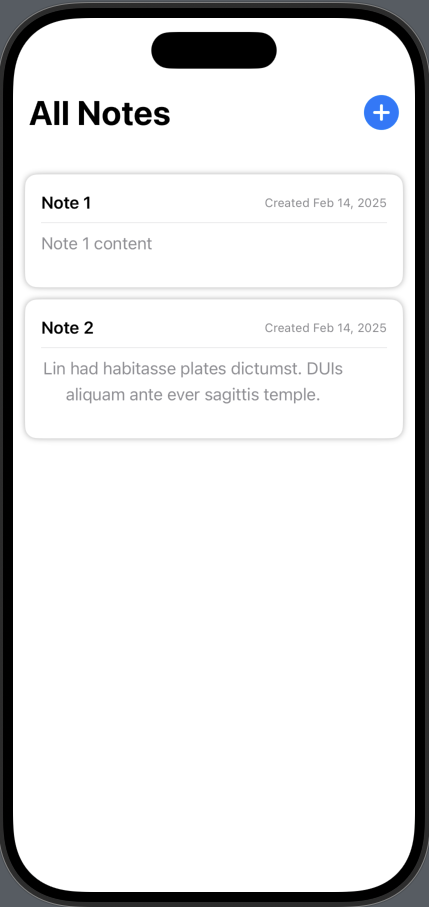
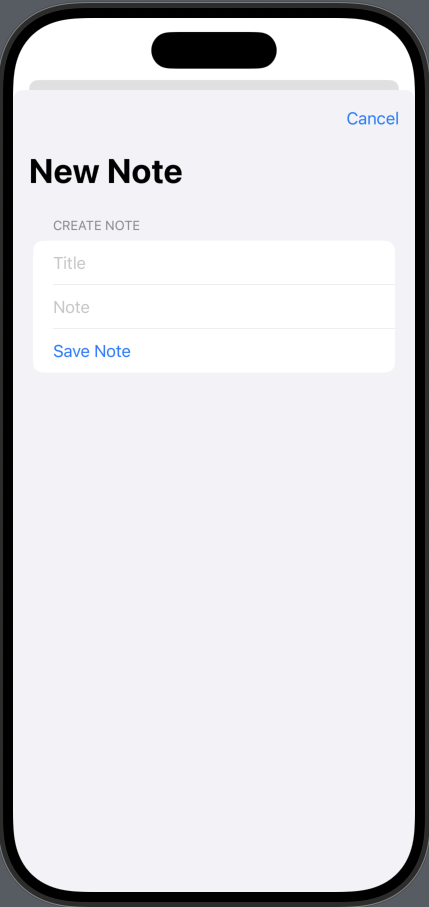
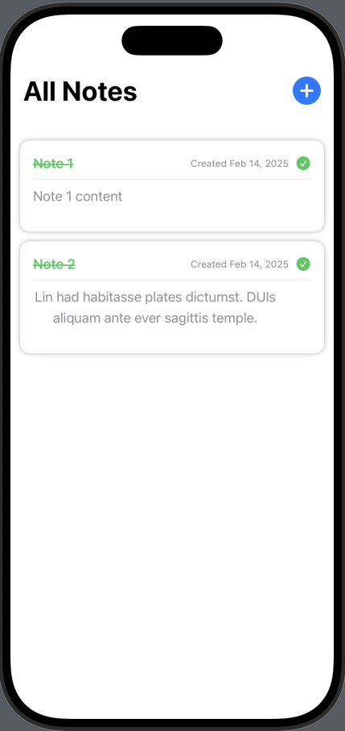

# 📒Note-Taking App

A simple and intuitive **note-taking app** built with **SwiftUI** that allows users to create, edit, complete, and delete notes. Notes are **saved locally** using JSON storage, ensuring persistence even after the app closes.

---

## ✨ Features
✅ **Add Notes** – Users can create new notes with a title and content.  
✅ **Edit Notes** – Modify existing notes for updates or corrections.  
✅ **Mark as Completed** – Toggle notes between "completed" and "incomplete" with a visual indicator.  
✅ **Delete Notes** – Remove unwanted notes from the list.  
✅ **Persistent Storage** – Notes are saved locally as **individual JSON files** for offline access.  
✅ **Navigation** – Seamless transitions between note lists, details, and creation views.  
✅ **Visual Indicators** – Completed notes display a **green checkmark** and **strikethrough**.  

---

## 📸 Screenshots

| Home Screen  |  Note Detail  |  Completed Notes |
|-------------|-------------|-------------|
|  |  |  |

---

## 🛠 Technologies Used
- **Swift** – Primary programming language  
- **SwiftUI** – Modern UI framework  
- **Combine** – Used for state management with `@ObservableObject`  
- **FileManager** – For local storage of notes as JSON files  

